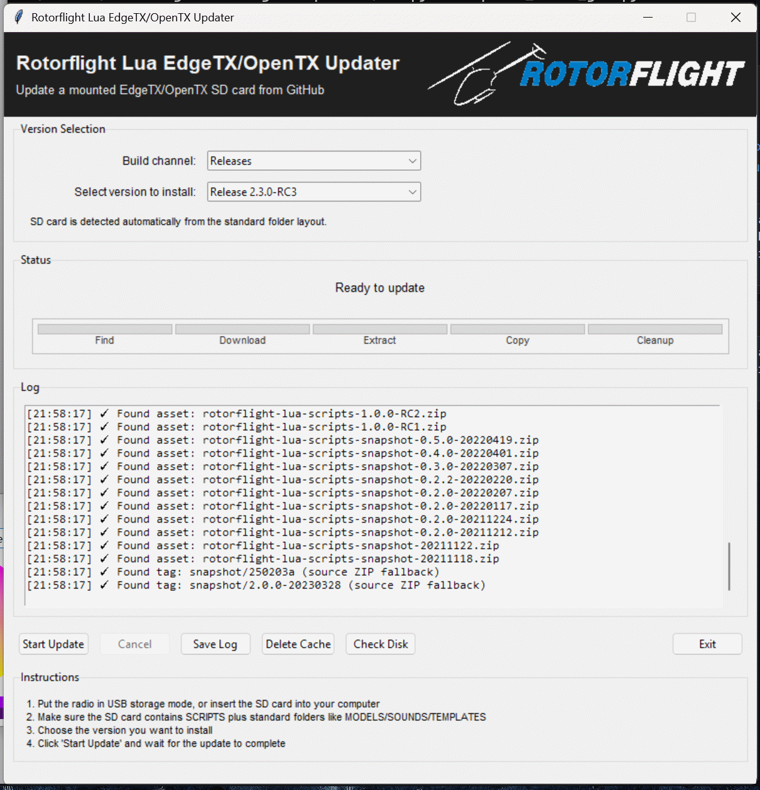

# Rotorflight EdgeTX/OpenTX Lua Updater

Desktop updater for [rotorflight/rotorflight-lua-scripts](https://github.com/rotorflight/rotorflight-lua-scripts).

It downloads Rotorflight Lua script packages from GitHub and syncs the `SCRIPTS` and `WIDGETS`
folders onto a mounted EdgeTX/OpenTX SD card.



## What It Does

- Detects a mounted radio or SD card automatically
- Lets you choose `Release`, `Snapshot`, or development builds
- Syncs `SCRIPTS` and `WIDGETS` to the SD-card root
- Keeps a local download cache
- Can run a platform disk check against the mounted SD-card volume

## SD Card Detection

Auto-detect looks for a mounted root containing:

- `SCRIPTS`
- plus at least 3 common EdgeTX/OpenTX SD-card folders such as:
  `MODELS`, `RADIO`, `SOUNDS`, `TEMPLATES`, `THEMES`, `LOGS`, `WIDGETS`

If the updater does not detect a card, mount the radio/SD card first and make sure
those folders are visible at the root.

## Download

Use the GitHub Releases page for updater binaries:

```text
https://github.com/rotorflight/rotorflight-lua-edgetx-updater/releases
```

## Running From Source

From `src`:

- Windows: `run_updater.bat`
- macOS/Linux: `./run_updater.sh`

The updater uses `tkinter`, so make sure your Python installation includes Tk support.

## Developer Notes

Compilation requirements:

1. Windows build host for PyInstaller packaging
2. Python 3.x on PATH
3. PyInstaller installed: `pip install pyinstaller`
4. From `src`, run: `make.cmd`
5. Output EXE: `src/update_radio_gui.exe`

Optional build inputs:

- `src/icon.ico`

## Install Behavior

The updater is designed around the release packaging of
`rotorflight-lua-scripts`:

- release assets contain ready-to-copy `SCRIPTS` and `WIDGETS`
- snapshot assets do the same
- `master` and recent development commits fall back to the repository source tree
- only Rotorflight-owned paths are mirrored aggressively
- shared namespaces such as `SCRIPTS/TOOLS` and `SCRIPTS/FUNCTIONS` are updated file-by-file without deleting unrelated content
